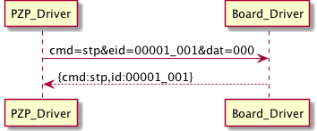

#HTTP DRIVER FOR ARDUINO MEGA BOARD

This HTTP driver allows the Arduino MEGA board to exchange sensors' and actuators' control information with the PZP through RESTfull Web Services. The driver is separated in two files:

* One representing the PZP driver (located in webinos/core/api/iotdrivers/lib/drivers/httpDriver.js)
* One representing the board (Arduino) driver (located in webinos/platform/arduino/arduino_mega/api/sensors_actuators_driver/sensors_actuators_driver.ino)

The hardware required by the HTTP driver is:

* [Arduino MEGA board](http://arduino.cc/en/Main/ArduinoBoardMega)
* [Arduino Ethernet Shield](http://www.arduino.cc/en/Main/ArduinoEthernetShield)

The PZP driver exposes a server to listen for incoming requests from the board. For this driver [express](http://expressjs.com/) server was used.

##HOW HTTP DRIVER WORKS

Once flashed with the driver and configured (view the next section), the Arduino board is ready to be connected to the PZP through a direct ethernet connection (or through a router).
At the first stage, the board periodically (every 2 seconds) tries to send to the PZP an hello message to introduce itself. This message is a tuple containing the following information:

* board_ID
* board_PROTOCOL
* board_NAME
* board_IP
* board_PORT

An example of hello message sent to *http://PZP_IP:PZP_PORT* is the following:

<pre>
GET /newboard?jsondata={"id":"00001","protocol":"HTTP","name":"ARDUINO_MEGA","ip":"192.168.1.2","port":"80"} HTTP/1.0
</pre>

Once the connection has been estabilished, if the board was successfully registered, the board sends back to the PZP an ack message with a payload containing the json string *{"ack":"newboard"}*.

The PZP driver can send requests to board server (listening at board_ip:board_port) using the following parameters:

* **cmd** (must be exactly 3 characters)
* **eid** (must be exactly 3 characters)
* **dat** (must be up to 30 characters)

The meaning of the above parameters changes depending on the kind of request. A detailed description of all the available requests is provided in the rest of this section.

###Getting the elements list
After the board has been configured, the PZP requires the list of the elements (sensors or actuators) directly connected to the board. This is possible through the **"ele"** command sent through the following request:

<pre>
http://board_ip:board_port/?cmd=ele&eid=000&dat=000
</pre>

The parameters **eid** and **dat** are not relevant for this kind of request and assume the null value 000.

The board replies sending back to the PZP Driver the same command of the request (ele), the board id (00001) and a list of elements as an array of JSON object. For example an object returned inside the *elements* array may have the following form:

<pre>
{"id":"00001_000", "element": {"sa":"0","maximumRange":"0.1","minDelay":"500","power":"0.02","resolution":"0.001","type":"temperature","vendor":"apple_temp","version":"1"}}
</pre>

###Starting sensors' acquisition

The board can start the sensor's data acquisition with the **"str"** command sent through the following request:

<pre>
http://board_ip:board_port/?cmd=str&eid=001&dat=vch
</pre>

Where **eid** represents the ID of the element to start and **dat** can assume values *"vch"* (valuechange) or *"fix"* (fixedinterval) and represents the eventFireMode described by Generic Sensors API.

The board replies sending back to the PZP Driver the same command of the request (str) and the element id which has been started (00001_001).

###Stopping sensors' acquisition

The board can start the sensor's data acquisition with the **"stp"** command sent through the following request:

<pre>
http://board_ip:board_port/?cmd=stp&eid=001&dat=000
</pre>

Where **eid** represents the ID of the element to stop. The **dat** parameter is set with the null value 000.

The board replies sending back to the PZP Driver the same command of the request (stp) and the element id which has been stopped (00001_001).

###Configuring a sensor

The board can configure a sensor with the **"cfg"** command sent through the following request:

<pre>
http://board_ip:board_port/?cmd=cfg&eid=001&dat=120:1500:fix
</pre>

Where **eid** represents the ID of the element to configure and the **dat** parameter contains a colon-separated tuple *"timeout:rate:eventfiremode"*. Each of these configuration parameters is described in the ConfigureSensorOptions class defined in the Generic Sensors API. Briefly

* **timeout** is a timeout value for when configureSensor() is canceled in seconds between 0-65535. Default value is 120 seconds. 0 means infinite.
* **rate** is the requested rate of the sensor data. It is the time interval before a new event is generated. The value is expressed in ms. If the interval is too small for the sensor (that is it is unable to generate data at the selected rate) it shall use the maximum rate it can support. 
* **eventfiremode** is the requested sensor event fire mode. It can assume two values: **fix** (is an abbreviation for *fixedinterval*) means that the sensor will send to the API its current value every a fixed time, **vch** (is an abbreviation for *valuechange*) means that the sensor will send its value every time this changes.

The board replies sending back to the PZP Driver the same command of the request (cfg) and the element id which has been configured (00001_001).

###Getting values from a sensor

After a sensors has been started, it sends the read value to the PZP. The way in which this communication takes place depends on the eventfiremode set for the sensor. If the eventfiremode is "fixedinterval" the sensor will send periodically the current value to the PZP.

Otherwise if eventfiremode is set to "valuechange" the board will notifiy the PZP only when the sensor's value changes.

###Setting value for an actuator
TBD

##HOW TO CONFIGURE HTTP DRIVER
The configuration file must be named **config.txt** and it must be placed in the **root folder** of the SD card. The configuration file contains a series of lines each one containing both a parameter name and a parameter value separated by spaces or tabs. A configuration line can be commented with the character '#'. 
Each configuration line must end with a carriage return.

It is possibile to configure the following parameters:

* **BOARDID**	Is followed by the board ID. [MANDATORY, e.g. 00001]
* **PZPIPAD**	Is followed by the PZP IP address [MANDATORY, e.g. 192.168.1.130]
* **PZPPORT**	Is followed by the PZP port where the express server is listening [MANDATORY, e.g. 1984]
* **BRDIPAD**	Is followed by the board's IP address. If not defined, the board tries to obtain an address through DHCP server. If there is not any DHCP server the default board IP address will be 192.168.1.120 [OPTIONAL]
* **BRDPORT** Is followed by the board's port where the server will be listening. If not defined, the default board's port will be 80. [OPTIONAL]
* **MACADDR** Is followed by the board's MAC address expressed in a colon-separated form. [MANDATORY, e.g. AA:AD:BE:EF:FE:BB]
* **ELEMENT** is followed by a 'colon-separated' tuple containing the following information for each element

<table>
  <tr>
    <th>ID</th><th>Parameters</th><th>Type</th><th>Meaning</th><th>Example</th>
  </tr>
  <tr>
    <td>1</td><td>ID element</td><td>char[3]
    </td><td>The element ID. Must be unique for the board</td><td>001</td>
  </tr>
  <tr>
    <td>2</td><td>SA</td><td>boolean</td><td>A boolean which values is 0 if the element is a sensor otherwise 1 if it is an actuator.</td><td>0</td>
  </tr>
  <tr>
    <td>3</td><td>AD</td><td>boolean</td><td>A boolean which values is 0 if the element is analog otherwise 1 if it is digital.</td><td>0</td>
  </tr>
  <tr>
    <td>4</td><td>PIN</td><td>integer</td><td>Represents the number of the pin where the element is attached to</td><td>5</td>
  </tr>
  <tr>
    <td>5</td><td>MAXIMUMRANGE</td><td>real</td><td>Represents the max range of sensor in the sensors unit.</td><td>0.22</td>
  </tr>
  <tr>
    <td>6</td><td>MINDELAY</td><td>integer</td><td>Represents the min delay of sensor allowed between two events in microsecond or zero if this sensor only returns a value when the data it's measuring changes.</td><td>600</td>
  </tr>
  <tr>
    <td>7</td><td>POWER</td><td>real</td><td>Represents the power consumption of sensor in mA used by this sensor while in use.</td><td>0.02</td>
  </tr>
  <tr>
    <td>8</td><td>RESOLUTION</td><td>real</td><td>Represents the resolution of the sensor in the sensors unit.</td><td>0.003</td>
  </tr>
  <tr>
    <td>9</td><td>TYPE</td><td>string</td><td>Represents the type of the element.</td><td>Allowed types are: light, noise, temperature, pressure, proximity, humidity, heartratemonitor</td>
  </tr>
  <tr>
    <td>10</td><td>VENDOR</td><td>string</td><td>Represents the vendor string of the element.</td><td>parallax</td>
  </tr>
  <tr>
    <td>11</td><td>VERSION</td><td>real</td><td>Represents the version of the element's module.</td><td>1.0</td>
  </tr>
</table>

An example of configuration file is the following:
<pre>
BOARDID		00001
PZPIPAD		192.168.1.3
PZPPORT		1984
BRDIPAD		192.168.1.120
BRDPORT		80
MACADDR		AA:AD:BE:EF:FE:BB
ELEMENT 	001:0:0:0:0.22:600:0.02:0.003:light:parallax:1.0
ELEMENT 	002:0:1:1:0.44:200:0.013:0.04:temperature:parallax:1.2

</pre>

**Note: Each configuration line must terminate with a carriage return.**

##HOW TO TEST HTTP DRIVER

* Connect the Arduino Board to the PZP (e.g. Notebok) directly through an Ethernet cable or alternatively through a router.
* Launch the PZP script
* Power-on the board

Note: The steps order can be whatever.

On startup the board reads the file config.txt to configure the main parameters. If the BRDIPAD parameter is defined the board will use it as IP address. Otherwise the board tries to obtain an address contacting the PZP's DHCP server, if the request fails the board's IP will be a default one (192.168.1.120).